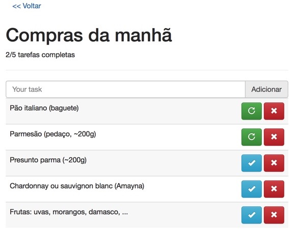

# To do List

O objetivo é ter uma _single page application_ onde o usuário pode:

- Listar e criar suas to-do lists
- Selecionar uma lista para ver/editar suas tarefas
- Adicionar/remover tarefas a esta lista
- Marcar uma tarefa com completa (ou não)

Apenas como referência, segue um screen shot com uma sugestão de design:

Não é necessário seguir este design/comportamento. Fique a vontade para (re)definir o design/comportamento que preferir. Por exemplo, se preferir usar checkboxes ao invés de botões que mudam de estado para indicar que uma tarefa foi concluída, tudo bem. Se quiser adicionar algo como um botão para limpar todas as tarefas concluídas, também.

Como o foco do teste é o back-end recomendamos o uso de banco de dados como mysql e etc, não esqueça de enviar junto um arquivo sql com a estrutura do banco

## Será avaliado

- Obviamente, o funcionamento da aplicação.
- O uso correto do git. Por isso, registre seus passos com commits que façam sentido e com mensagens claras e objetivas. Crie branches quando achar que faz sentido.
- A qualidade do código. Do nome que é dado para os elementos (classes, arquivos, recursos, ...) à separação de responsabilidades. Faça de conta que isso faz parte de um projeto que vai crescer, mas tome cuidado com a "over-engineering".
- Como você completa as lacunas desta especificação. Muita coisa não foi dita.

## Recomendações

- Testes.
- Mantenha o código limpo, simples.
- Use bem os recursos da linguagem e as ferramentas.
- Recomendamos o uso do framework codeigniter ou laravel.
- Se interessar, apresente duas versões, uma sem e outra com o framework codeigniter.
- Se interessar, faça a application integrado com o Google Tasks API https://developers.google.com/tasks/reference/rest
